# スマホで始めるWebアプリ開発

## 時間の確保という大きい壁

アウトプットが大事・自己ブランディングの時代と、会社に依存せず、自分自身でスキルを磨くことが求められている昨今、アプリを作ろう！と意気込んで休日に環境構築したもののいろんな理由で時間がとれないなんて、ありがちなのでは？  
もしくは少し慣れてきて、仕事中に家帰ったらアレやろうコレやろうと考えるも、いざ帰ると布団に伏せってしまって、それどころじゃない。  
そんなこと有りませんか？僕はあります。

人間疲れたときに休むのが一番。無理して動いても、寝るときに変に興奮して寝られないなんて事もあります。（一人暮らしだからできる時間の使い方ではありますが）  
家帰ったら休む。  
仕事はやる。  

さて、どこでアプリを作りましょうか？  
仕事帰りに、電源とWi-Fiのあるお店で、作業する？  
それも、手ですね。家に帰っていないので、仕事中に考えていた事もできそうです。  
でも、それはそれで、時間の確保が必要です。残業してしまった日には難しそうです。  

では、どうするか？  
あなたの家から職場までの間に何がありますか？  
言い方を変えましょう。あなたは家からどうやって職場に向かってますか？  
関東圏に話を絞って、地方の方に、大変申し訳ないのですが、多くの人は電車じゃないでしょうか。  
総務省　統計局の調査によると、関東圏の平均通勤時間は、1.3時間だそうです。
往復だと、2.6時間、これが電車の乗車時間なら、アプリの一機能作るのには、十分すぎる時間です。  
しかも、わざわざ確保しなくて良い強制的に発生する時間です。


出典：平成28年社会生活基本調査　生活行動に関する結果　結果の概要 - 総務省　統計局  
[https://www.stat.go.jp/data/shakai/2016/pdf/gaiyou2.pdf](https://www.stat.go.jp/data/shakai/2016/pdf/gaiyou2.pdf)

べつに通勤時間の全部を費やせと行っているわけではありません。  
その間の30分だけでも、コードを書くのに使って、GttHubにPushすればあなた個人の実績になります。  
一行でも良い。それを積み重ねれば、かなりの実績になります。  
（え、会社が徒歩圏内？それは、素直に会社に残るか家に帰ってやりましょう。近くのお店でも良いと思います。スキマ時間を圧縮しようと行動したその行動力が羨ましいです。）

## 移動時間でコードを書こう

なるほど！移動時間でアプリを、作ればいいのか！  
明日から、電車の中でコード書こう！  
そう思って、あなたはカバンにノートノートパソコンを入れて、家を出ました。  

しかし、現実は非常です。

- 満員電車で座れない
- 座れてもノートパソコンが出せるほどの余裕がない
- ノートパソコンは重い

上記の理由からせっかくカバンにノートパソコンを入れても、ただの重りにしかならないケースが多いです。  
ノートパソコンを広げて、悠々とコーディングできるほど、日本の通勤電車は甘くないんですね。（使う路線にもよりますが）  
しかも、ノートパソコンって重いんです。  
薄いMacBook Airでも、1.2Kgするんです。  
慣れれば、どうってことないという意見もあると思いますが、僕は辛いです。（1か月間やったけど、慣れなかったです）

そこで、スマホを使ってコードを書くというソリューションの提供です。  
(ここで、ラズパイ持ち歩こうよ！とか言い出す人は、対象としていませんw)

スマートフォンは、上記の問題点を解決してくれます。

- 座れなくても打ち込める
- ポケットからサッっと出せる
- スマホは軽い

座れなくてもスマホで何かみている人は多いですよね。  
仕事で疲れていてもスマホで何かしてますよね？  
Twitterとかソシャゲ、あとは動画をみている人もいますよね。  
ポケットに入れていることが多いから、サッと取り出せますしね。  
そして、何よりスマホってパソコン比べると軽いんです。  
iPhone 11 Pro MAXでも223gで、MacBook Airの約5分の1なんです。  
僕がつかっているXperia XZ2 Premiumでも、236gで充分軽い。  
(え？スマホでコードなんて書けるか？普段、LINEやTwitterで日本語書いてるのに、コードの一行すら書けないんですか？？)

## いつでもどこでもスマホで始めよう

スマホで？どうやって？  
からくりは単純です。Linux環境をスマホに入れます。  
何も難しいことはしません。  
以下の必要なアプリを2つ入れるだけです。

- termux
- Hacker's Keyboard
  
どちらも、Playストアから入手できます。  
次することは、普段ソシャゲのアプリを起動するようにTermuxのアプリアイコンをタップするだけです。  
簡単でしょ？

## Termuxとは

Termuxとは、Android用の端末エミュレータと言うアプリです。
AndroidでLinuxのCLI環境を使う事ができます。
端末エミュレータだけなら、Playストアに多く存在しますが、このTermuxは、Debian系Linuxでお馴染みのパッケージ管理ソフトの`apt`が使えます。
つまり、普段、開発で使っているLinuxのツールが使えるのです。（正確には、ARM CPUに対応したパッケージがある場合のみ）
他にも、SSHで外部から接続ができたり、SDカードにアクセスしてAndroidとのストレージを共用することも可能です。

## Hacker's Keyboardのセットアップ

キーボードは入れただけでは利用できず、設定が必要です。  
Hacker's Keyboardのアプリを起動して「ENABLE KEYBOARD」を、タップします。  
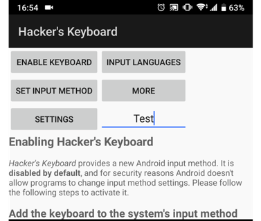  
タップするとキーボード管理画面が出るので、Hacker's Keyboardの横のトグルスイッチをタップして、有効にします。  
初回は有効にするか確認のダイアログが出ますので、OKをタップします。  
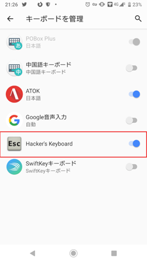  
この設定が完了すれば、Termuxを使うときに「Hacker's Keyboard」へ切り替えられます。  
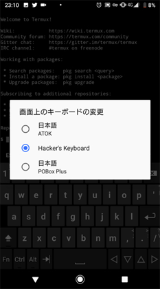

**TIPS: キーボードの切り替え変更ダイアログの出し方**  
使っているスマホまたはAndroidのバージョンによって、キーボードの変更ダイアログの出し方が異なります。下の画像のように、右端にアイコンが表示されるものもあったり、通知バーの中に表示されるものもあります。  

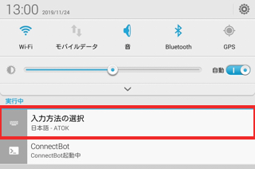

## Vue.jsの開発環境のセットアップ

ここからは、Vue.jsのセットアップを行なっていきます。
とくに難しいことはなく、Linuxでのセットアップを参考に進めていくことができますので、細かいところを省いていきます。

npmを利用するのに、Nodejsをインストールします。

```bash
$ sudo apt install nodejs
```

サクッと、シンプルに始めるためにVueCLIをインストールします。

```bash
$ npm install -g @vue/cli
```

インストールが完了したら、後は、`vue create`コマンドで、  
プロジェクトの作成を行います。
プロジェクトは、ユーザーが返答を入力する対話形式と呼ばれる形式で進んでいきます。

```bash
$ vue create my-project
```

プロジェクトの作成が終了したら、以下のメッセージが表示されます。  
後は、画面にしたがって、ディレクトリを移動、開発用サーバーを実行します。  
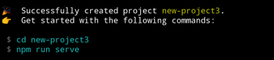

```bash
$ cd my-project
$ npm run serve
```

サーバーのIPアドレスが表示されたら、Termuxからアプリを普段使っているWebブラウザーに変更して、表示されているアドレスにアクセスして、ウェルカムページが出たらセットアップは完了です。お疲れ様でした。


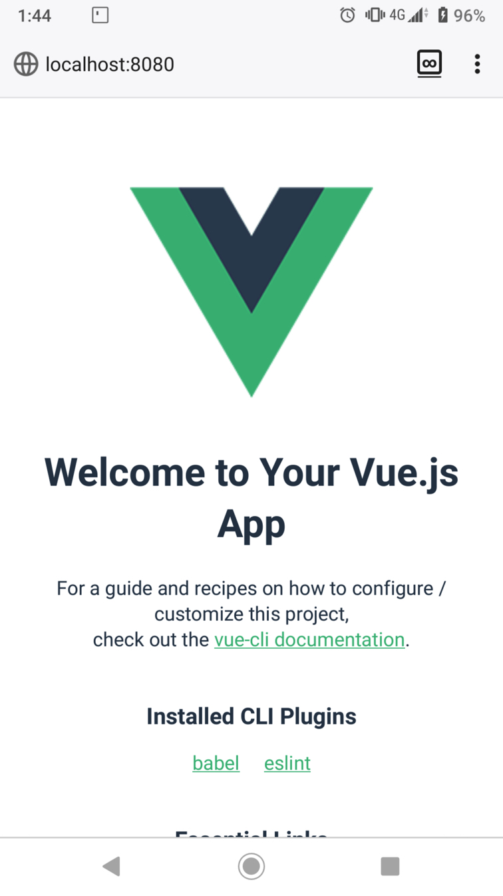

## PCとのビルド速度比較

ここまで、やってきたものの、スマホのスペックでどこまでできるのか
気になりますよね？　動くけど、パソコンより遅いなら、実用性がないネタ環境になってしまいます。  
そこで、PCでも、VueCLIを使ったVue.jsの環境を作って、PCとどのくらい差が出るのか。比較してみました。

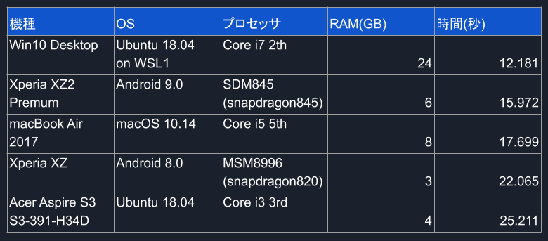

結果として、1位のデスクトップはRAM:24GBを乗せたモンスターマシンなので、当然の結果とも言えます。
注目すべき点は、開発機として標準的なスペックのMacBook AirよりスマホのXperia XZ2 Premiumの方が、ビルド速度が1秒早かったと言う点です。

モバイル機器でLinnxを動かすと言うのは、1900年代から行われていた試みではありました。  
しかし、限定的な動作だったり動作が緩慢であるなど、さまざまな制限がある上にその工程にはリスクが伴い、実用性にも乏しいハイリスク・ローリターンの道楽の一貫でしかなかったのです。そもそもモバイルPCと言うマイナージャンルだったのが輪をかけて。

だが、今回の結果から、ここ、2、3年のスマホのスペックは開発用PCの標準的なスペックと十分肩を並べるパワーがあるとわかりました。

もはや、たかがモバイル機と侮ってはいけない。
誰しもが手のひらで開発できちゃう時代がきていたのですね。

## Androidとファイル共有

termuxはAndroidとのファイル連係が可能です。
その方法は2つあります。

- ファイルアプリからアクセスする
- termux-setup-storageを実行する

### ファイルアプリからアクセスする

Android 5.xから標準で入っている「ファイル」と言うアプリから、Termuxを選ぶと、Termux上で作成したファイルの操作が可能です。
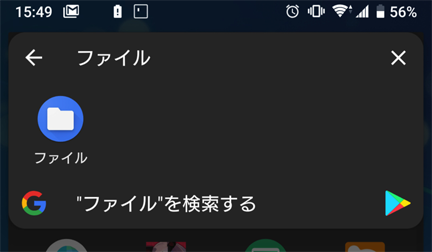
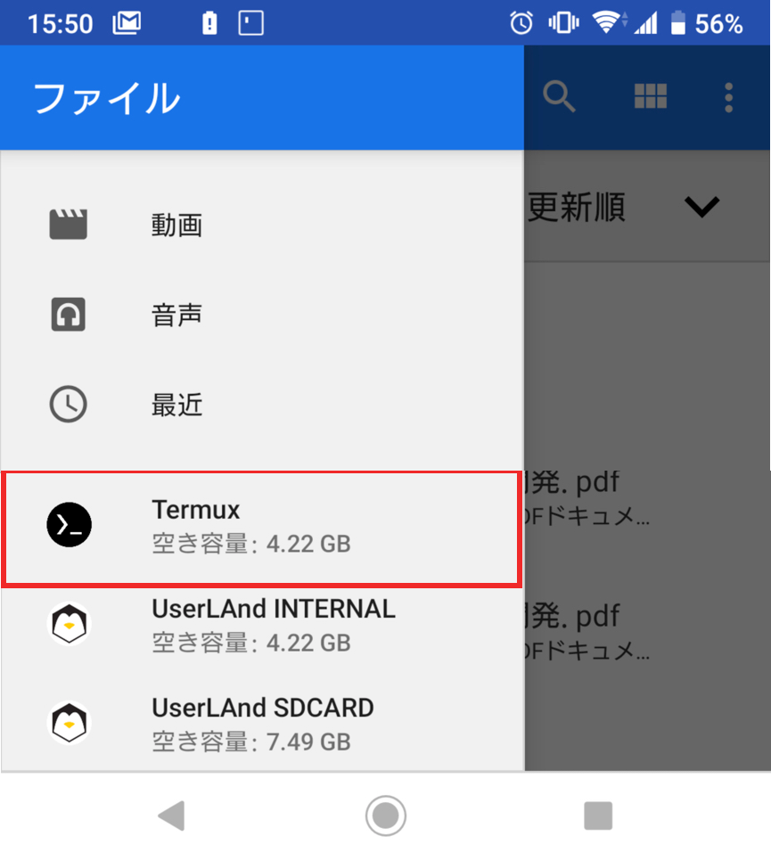

### termux-setup-storageを実行する

もう1つは、Termux上で`termux-setup-storage`コマンドを実行することにより、Termuxのホームディレクトリに、storageと言うディレクトリができます。
そこからAndroidのストレージへ読み書きができます。

| Termux上のパス | Android上のパス | 説明 | 
| --- | --- | --- |
|~/storage/shared|/storage/emulated/0/|Androidの内部ストレージのルート|
|~/storage/downloads|/storage/emulated/0/downloads/|インターネットでダウンロードしたファイルが保存される|
|~/storage/dcim|/storage/emulated/0/DCIM/|カメラで撮影した画像・動画が保存される|
|~/storage/pictures|/storage/emulated/0/Picture|スクリーンショットなどの画像が保存される|
|~/storage/music|/storage/emulated/0/Music|音楽が保存される時がある|
|~/storage/movies|/storage/emulated/0/Movies|動画が保存される時がある|
|~/storage/external|/storage/<SDカードのベースパス>/Android/data/com.termux/file|SDカード上のtermux専用ディレクトリ|

## エディターについて

最後に、エディタの話を少しします。
と言っても、Androidのコーディング用アプリは、これといったものがなく
シンタックスハイライト（コードの色分け）が不十分だったり、入力補完がない・あってもごくごく簡単なもの、改行時にインデントが挿入されない。カッコを入力しても閉じカッコは入らないなど、PCと比べると非力です。

その中で、QuickEdit テキストエディターをお勧めします。
その理由ですが、

- シンタックスハイライトが十分
- 自動で閉じカッコやインデントを入れてくれる
- 未対応でも似たような言語のハイライトを関連付けすることができる。
- よく使うディレクトリをお気に入りとして、登録できる。
- 自動保存機能がある

と言うように、コードを書くときに、最低限の必要な機能があります。
前セクションの"termux-setup-storageを実行する"を、行なっている場合、このアプリから見えるディレクトリにプロジェクトを置けば、このエディタで編集してTermuxでビルド・テストと言う流れで開発ができます。

## GUI環境を作る

UserLAndと言うAndroid上でLinuxを走らせるアプリがあります。
これで入れたLinuxでは、CLIだけではなく、GUiを使った環境を作る事ができます。
入れられるLinuxの種類は、Ubuntu・Debian・Alpineなど、さまざまです。

Linux環境の作り方は簡単で、インストールしたUserLAndアプリを起動して、入れたい種類を選び、ユーザー名・OSのパスワード・VNCのパスワード・接続方式を選ぶとインストールが始まります。

今回は、Ubuntuを選びます。

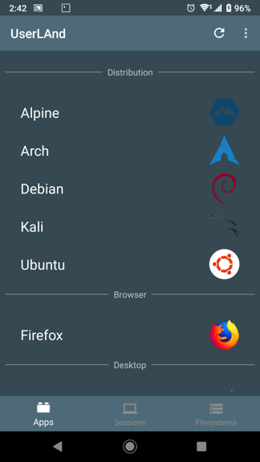
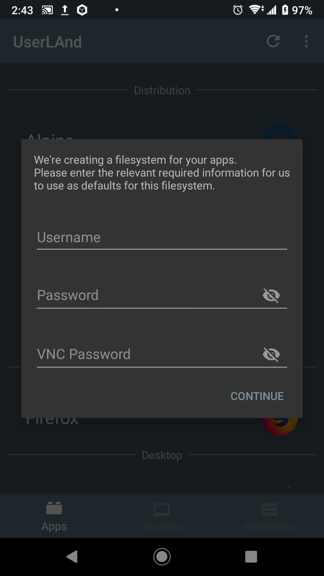

最初は、SSHを選択します。
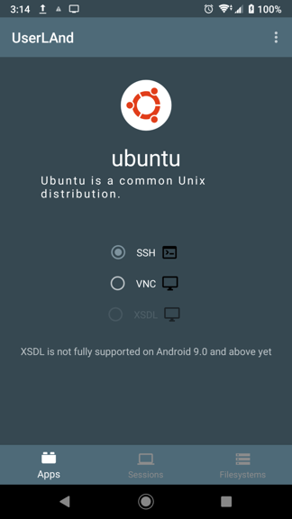
インストール完了後、自動で接続されます。
表示されたコンソールで、以下のコマンドを実行して、デスクトップ環境をインストールします。

```bash
sudo apt-get install lxde
```

インストール後、”Sessions”タブに移動し、Ubuntuのセッションを長押しして現れる"Stop Session"で、一旦セッションを終了します。


終了後、appsタブのUbuntu長押しからのApp Infoをタップして、接続をSSHからVNCに変更します。
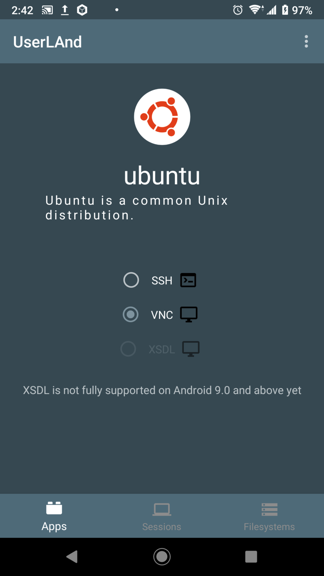

再接続後、デスクトップ画面が現れれば、環境の構築は完了です。
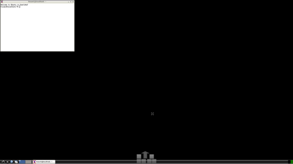

最初は、スマホの解像度が大きく、文字が小さくなるので、~/.vncrcで、適度な解像度に設定し直してください。

```
# 1280x800に変更する例
$geometry = "1280x800";
```

## 最後に

国内のWebをはじめとした開発がLinuxやMacで行う事が一般的になってきた時代背景も含め、
スマートフォンのスペックの高さから、Android端末で開発を行うと言う手法も、現実的なラインにまで達しました。  
ノートパソコンに比べて、6インチと小さい液晶・長文を打つには、やや不向きなソフトウェアキーボードで快適に行えるかと言うと肯定しづらいのが、正直なところですが。  
最近、見た映画のセリフでこんなものがあります。

「100KBの駄作は0KBの良作に勝る」

つまり人生、行動した者勝ちです。  
世の中のベストプラクティスも失敗を経験してから知る事ができれば、知識ではなくて知見です。
なぜ、その手法がいいのか理解も早いでしょう。

スマホを使った開発環境に不満を感じてきたら、ご自身で改善してみてください。
Bluetoothキーボードやマウスを繋いで、昼休みに机やファレミスの待ち時間にコードを書くのもいいでしょうし、中古の画面が大きいけど低スペックのタブレットを買って、SSHやVNCで繋いでより大きい画面で開発するのもいいでしょう。折りたたみキーボードやスレートタイプのマウスを買えば、携帯性を維持しながら、シチュエーションに応じて使い分ける事も可能です。  
タブレットを買ったら、ノートパソコンと変わらない、と思うかもしれませんが、8インチ程度ならスマホと同じくらいの重量です。荷物は増えてしまいますが、まだ、軽いです。
大事なのは、どうすれば自分がなるべく無理をせずに環境や習慣を維持できるかと言う点です。
環境の維持にコストを多く割いてしまってが、楽しむ事もできませんので。

今回は時間を取ることが難しく作業できないケースに対して、スマホを開発機にすると言うアプローチで問題を解決しましたが、もし、お気に入りのお店や作業時間が確保できるようになったら、
パソコンでやってもいいと思います。自分にあった開発スタイルを見つけてみましょう。

## 参考URL

[Termux-setup-storage - Termux Wiki](https://wiki.termux.com/wiki/Termux-setup-storage)
[ホイール欲しい ハンドル欲しい &raquo; ARM CPU 上の開発環境とコンパイル時間の比較](https://wlog.flatlib.jp/item/1844)
[ホイール欲しい ハンドル欲しい &raquo; Android: UserLAnd + Termux を Note PC 代わりに使う](https://wlog.flatlib.jp/item/1885)
[linux:userland [HYPERでんち]](https://dench.flatlib.jp/linux/userland)
[QuickEdit テキストエディター - Google Play のアプリ](https://play.google.com/store/apps/details?id=com.rhmsoft.edit&hl=ja)